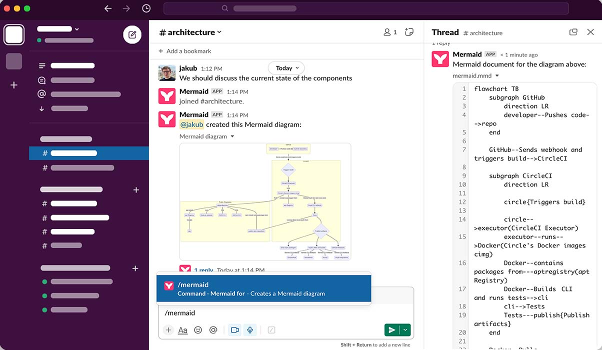

# [Mermaid Preview](https://mermaid-preview.com)

This is an app for Slack that renders [Mermaid](https://mermaid-js.github.io/mermaid/#/) diagrams in Slack.

This app adds a `/mermaid` command to your Slack workspace. You can use it to post Mermaid diagrams in Slack messages. It also automatically renders Mermaid source sent in a code block in any channel where the app is a member.

## How it works

The app listens for a `/mermaid` command and opens a Slack modal where you can enter your Mermaid diagram code. It also listens for messages containing either a `mermaid` Markdown code block or an ordinary Slack code block containing valid Mermaid source. The first Mermaid diagram detected in a message is rendered as a threaded reply.

Diagrams are rendered using [Mermaid CLI](https://github.com/mermaid-js/mermaid-cli) into a PNG file. This PNG is uploaded to Slack and posted as a message. The temporary PNG is deleted from the server after it's posted.

For automatic previews, invite Mermaid Preview to the channel. Fork deployments must subscribe the Slack app to the `message.channels` and `message.groups` bot events. Existing installations must be reinstalled to grant the new `channels:history` and `groups:history` scopes.

## Wishlist

- [x] Edit already posted diagram (through Modal?)
- [x] Automatically detect Mermaid diagrams in messages and render them
- [ ] Live preview of the mermaid document in the modal? Seems like this can't be done with Slack's UI limitations.
- [ ] Support DMs, [more context in the comment](https://github.com/JackuB/mermaid-preview/blob/ac9d7561d5bc8199425e189e6996817ee1e2ae82/src/commands/index.ts#L20-L45).
